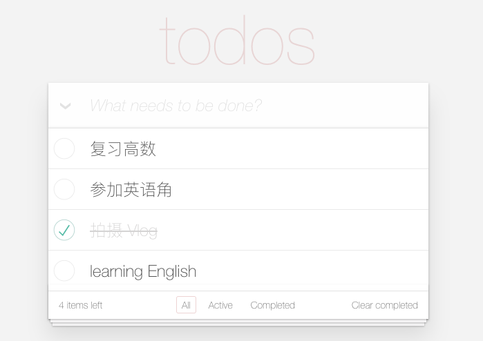

## 介绍

这是一个用 Dart 编写的 web todo app，总体来说前端开发人员学习 Dart 的成本极低，尤其是熟悉 TypeScript 的同学，Dart 和 TypeScript 一样都可以使前端开发更加规范化、工程化，但是 Dart 编译成 js 后动不动就是几万行，这对于需要用户下载的脚本来说是一个很值得考虑的问题（至少目前的网络环境下是需要放在很高的优先级的），而且 Dart 接入目前的 js 生态成本比较高，所以相比于 TypeScript 来说，Dart 在直接编写前端方面目前并没有优势。



## How to use

```bash
git clone
```

```bash
pub get
```

```bash
webdev serve
```